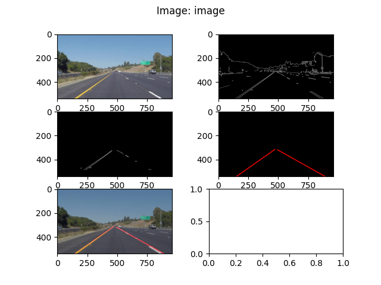

# **Finding Lane Lines on the Road** 

Overview
---

When we drive, we use our eyes to decide where to go.  The lines on the road that show us where the lanes are act as our constant reference for where to steer the vehicle.  Naturally, one of the first things we would like to do in developing a self-driving car is to automatically detect lane lines using an algorithm.

### 1. Plan

The implemented pipeline consists of the following steps:
 1. Reading an image.
 2. Converting image to grayscale.
 3. Blurring image using Gaussian smoothing technique.
 4. Detecting edges using Canny edge detection algorithm.
 5. Selecting ROI (Region of interest) where we expect to find object.
 6. Getting all the detected lines by using Hough transformation.

#### 1.1. Reading an image

 This step only includes using openCv function `imread` to read an image. The read images are in JPG format and have RGB channels, in other word every pixel has the following possible range of values [0-255, 0-255, 0-255], for red, green and blue color.

#### 1.2. Grayscale
 In this step the idea is to reduce the 64 bit pixel to 8bit pixel, to havel only black-white color range. That is being done by using `cv2.cvtColor(img, cv2.COLOR_RGB2GRAY)` function.

#### 1.3. Gaussian Smoothing

 This step uses algorithm for smoothing images. In short description it uses a kernel (basically a matrix) which visits every area of image and blurs it using [Gaussian function](https://en.wikipedia.org/wiki/Gaussian_blur#:~:text=In%20image%20processing%2C%20a%20Gaussian,image%20noise%20and%20reduce%20detail.). This step is necessary to reduce the noise in images and improve the results of the next steps.

#### 1.4. Canny Edge Detection

 Canny edge detection is one of the algorithms used for detecting edges in images and internally it also uses Gaussian filter in order to remove the noise. This project uses `cv2.Canny` function from openCv. Canny edge algorithm needs only two numbers:
  1. Low Threshold,
  2. High Threshold.
 For every pixel in image the following is applied:
  - `pixel_value < low_threshold` => pixel is ignored (suppressed edge pixel)
  - `pixel_value > high_threshold` => pixel is detected as an edge (strong edge pixel)
  - `low_threshold < pixel_value < high_threshold` => pixel is detected and considered as an edge if it is connected to the already detected edge (weak edge pixel)

  In this work first were used empirical values, and than I have decided to use adaptive search for thresholds presented here(https://www.pyimagesearch.com/2015/04/06/zero-parameter-automatic-canny-edge-detection-with-python-and-opencv/).

#### 1.5. ROI Selection

 This part deals with selecting with part of image that we are sure the object we want to detect is located. The picked values are chosen empirically.

#### 1.6. Hough Transformation

 The final step uses openCv function `cv2.HoughLinesP` for detecting all lines on selected part of image from previous step. The idea is to get all lines that are detected and to find the lines on a road. This part is the most tedious to solve since the results from previous steps were mostly visible in this, because they directly influence which lines were detected. The parameters which determine the behavior of Hough transformation are:
 - `rho` => distance resolution in pixels of the Hough grid
 - `theta` => angular resolution in radians of the Hough grid
 - `threshold` => minimum number of votes (intersections in Hough grid cell)
 - `min_line_len` => minimum number of pixels making up a line
 - `max_line_gap` => maximum gap in pixels between connectable line segments
 The Hough transformation works by converting the pixels from image space to Hugh space (otherwise known as parameter space), and that is being done in order to easier find lines in image space, becaus you only need to look for points in Hough space. (Image space: `y = mx + b` => abscissa: x, ordinate: y, Hough space: `b = y - xm` abscissa: m, ordinate: b). This is excellent idea to quickly detect lines, and the output of `HughLinesP` function are group of lines defined by 4 points.

 The problem lies that road lines are not always straight, in other words sometimes they are dotted, and in order to successfully mark the line we mast extrapolate the points. That is being done by analyzing the detected points and determining the best continuation of these points. The assumption is that there won't be big curvatures and therefore we can assume that we are looking for straight line (that can be described by `y = mx + b`). And also what was assumed that we want only two lines one coming from left to right (positive slope) and other from right to left (negative slope). There were several methods tried out:
  1. Calculating the average slope and intercept.
  2. Finding the median slope and intercept.
  3. Calculating RMS ([Root Mean Square](https://en.wikipedia.org/wiki/Root_mean_square)) slope and intercept.
  4. Using `np.polyfit` to get polynomial of first degree.
  5. Calculating [weighted mean](https://en.wikipedia.org/wiki/Weighted_arithmetic_mean) slope and intercept (where weight is the length of Hough line).

 The best one was determined empirically and it was No. 5.

You can check out the steps in this image:

### 2. Potential shortcomings

The biggest shortcoming of detecting lines in such way it too many assumption about the image we will receive such as we expect certain environment conditions, position fo camera to be the same, no strange light effects. Since the idea for detecting lines is essential for any drive assistance mistakes are not tolerable.

### 3. Possible improvements

A possible improvements would be:
 1. Canny Edge Detection works really unreliably when there are strange light effect in image, which can be seen by running this algorithm ono challenge video. Adjusting different parameters which would be dependant on lighting conditions in image, or maybe nullifying extremes pixels in image (too much light on road) in order to not allow extremes to ruin detection.
 2. Improve ROI selection, since the cutting the noisy part of images would be great and would improve the detection drastically.
 3. Improving the pipeline for detecting line, so that every frame know where the previous frame detected image, so that there is not too much discrepancy between frames. (If the next frame suddenly detect line totally off from previous n frames keep the show the results from previous frame and not from this one.)
